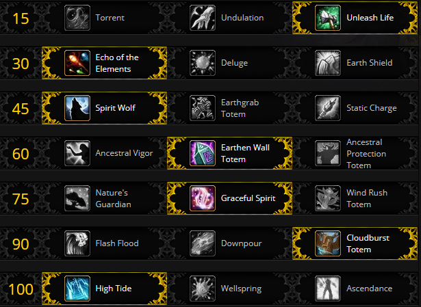

# Fight Mechanics

While Champion of the Light is the first encounter in Battle of Dazar'alor, there are a few key mechanics to look out for as a healer.  There is raid wide damage every time the boss melees during [Seal of Retribution](https://ptr.wowhead.com/spell=284469/seal-of-retribution).  Use AoE healing spells frequently to combat this.  Also the tank who is tanking the main boss will be taking increased damage over time from [Sacred Blade](https://ptr.wowhead.com/spell=283572/sacred-blade), make sure to keep an eye on this tank as you are healing the raid.  When [Seal of Retribution](https://ptr.wowhead.com/spell=284469/seal-of-retribution) ends and [Seal of Reckoning](https://ptr.wowhead.com/spell=284436/seal-of-reckoning) begins the constant raid damage will cease.  Any damage done to the boss from a target without [Sacred Blade](https://ptr.wowhead.com/spell=283572/sacred-blade) will cause the boss to gains stacks of [Zealotry](https://ptr.wowhead.com/spell=284459/zealotry).  When all the adds are defeated or when the boss reaches full energy, the boss will cast [Judgement: Reckoning](https://ptr.wowhead.com/spell=284474/judgment-reckoning) which you will want to use defensive cooldowns for.  Lastly, the boss will periodically cast [Wave of Light](https://ptr.wowhead.com/spell=283587/wave-of-light).  Make sure to dispel anyone who is hit by the wave as it deals a large amount of damage over time.  Once the boss hits 30% health, it will cast [Avenging Wrath](https://ptr.wowhead.com/spell=282113/avenging-wrath), increasing its damage by 30%.  On mythic difficulty, the boss will also cast [Prayer for the Fallen](https://ptr.wowhead.com/spell=287469/prayer-for-the-fallen).  During this cast any Disciple adds, and their ghosts will need to be interrupted, use [Wind Shear](https://www.wowhead.com/spell=57994/wind-shear) to prevent them from healing the boss to full health.  Also the Crusader adds will cast [Divine Mallet](https://ptr.wowhead.com/spell=287439/divine-mallet) which sends out a spiral of hammers in four directions that deal damage on contact with players.

# Suggested Talents

Due to the constant raid damage present during most off the encounter [EWT](https://www.wowhead.com/spell=198838/earthen-wall-totem) and [HT](https://www.wowhead.com/spell=157154/high-tide) are recommended.  You could drop [CBT](https://www.wowhead.com/spell=157153/cloudburst-totem) in favor of [Downpour](https://www.wowhead.com/spell=207778/downpour) as they will perform similarly throughput wise, but [CBT](https://www.wowhead.com/spell=157153/cloudburst-totem) is one less global and slightly more efficient mana-wise.  You could consider using [Ascendance](https://www.wowhead.com/spell=114052/ascendance) if you want to go full burst healing mode, but it's not recommended unless your co-healers are fine using their cooldowns to supplement your lack of healing outside of [Ascendance](https://www.wowhead.com/spell=114052/ascendance).

# Notable Azerite Traits

The two most efficient azerite powers on this encounter are [Spouting Spirits](https://www.wowhead.com/spell=279504/spouting-spirits) and [Overflowing Shores](https://www.wowhead.com/spell=278095/overflowing-shores).  Since you will be keeping [HR](https://www.wowhead.com/spell=73920/healing-rain) on cooldown for [Seal of Retribution](https://ptr.wowhead.com/spell=284469/seal-of-retribution), [Overflowing Shores](https://www.wowhead.com/spell=278095/overflowing-shores) will provide a large amount of healing throughout the encounter.  [Spouting Spirits](https://www.wowhead.com/spell=279504/spouting-spirits) is good as you will be using [SLT](https://www.wowhead.com/spell=98008/spirit-link-totem) right before the boss casts [Judgement: Reckoning](https://ptr.wowhead.com/spell=284474/judgment-reckoning) which will allow [SLT](https://www.wowhead.com/spell=98008/spirit-link-totem) to quickly top the raid.

# Healing Tips

* This fight is very short, spam AoE heals like [CH](https://www.wowhead.com/spell=1064/chain-heal) or [HR](https://www.wowhead.com/spell=73920/healing-rain) as much as needed.  During [Seal of Retribution](https://ptr.wowhead.com/spell=284469/seal-of-retribution) you can use a channeled mana potion if you think you'll need more mana.
* Dispel [Wave of Light](https://ptr.wowhead.com/spell=283587/wave-of-light) as fast as possible especially later in the fight as the damage it deals scales off the boss's stacks of [Zealotry](https://ptr.wowhead.com/spell=284459/zealotry).
