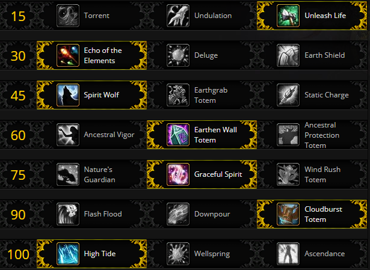

## Fight Mechanics

Stormwall Blockade is a two phase fight in which you start by fighting Sister Katherine and Brother Joseph.  Regardless of which boat you start on, you will have to deal with both the Sister and the Brother, just in different orders.  

Sister Katherine has the following mechanics:

* [Voltaic Flash](https://www.wowhead.com/spell=284262/voltaic-flash) - simply don't stand in the beams.  If it is a pattern where it starts from one edge of the boat and slowly progresses towards the other edge, stand in a "fresh" beam, wait for the beam next to you to "fire" then move where it was.
* [Crackling Lightning](https://www.wowhead.com/spell=284106/crackling-lightning) - move this away from your group members then once it drops off you, move away from it to not get silenced.
* [Jolting Volley](https://www.wowhead.com/spell=287169/jolting-volley) - use HR and CH to top off your group members as this is Sister Katherine's filler spell and it does a fair bit of damage.
* [Electric Shroud](https://www.wowhead.com/spell=287995/electric-shroud) - this places an absorb shield on Sister Katherine and makes her kick immune, this is essentially your time to catch up on healing if needed or to throw out a few DPS spells.

Brother Joseph has the following mechanics:

* [Sea Storm](https://www.wowhead.com/spell=284360/sea-storm) - multiple players will be targeted and drop a pool of [Sea Storm](https://www.wowhead.com/spell=284360/sea-storm) when Joseph's cast completes.
* [Sea's Temptation](https://www.wowhead.com/spell=284383/seas-temptation) - a Tempting Siren will appear and charm a DPS member dealing single target damage over time to them and compelling them to walk towards the Siren and off the boat.  Focus healing on any player charmed as they are likely to die without focused heals.
* [Tidal Volley](https://www.wowhead.com/spell=284316/tidal-volley) - see Sister Katherine's [Jolting Volley](https://www.wowhead.com/spell=287169/jolting-volley).
* [Tidal Shroud](https://www.wowhead.com/spell=286558/tidal-shroud) - see Sister Katherine's [Electric Shroud](https://www.wowhead.com/spell=287995/electric-shroud).

In Mythic difficulty, Spawns of Laminaria are present near the two boats and they will cast [Sea Swell](https://www.wowhead.com/spell=288258/sea-swell) every 20 seconds.  The easiest way to handle this is to have everyone create a stack point and "dip" into the [Frozen Tidepool](https://www.wowhead.com/spell=285075/freezing-tidepool)s on the ground when [Sea Swell](https://www.wowhead.com/spell=288258/sea-swell) is cast to prevent the entire boat from being covered by [Frozen Tidepool](https://www.wowhead.com/spell=285075/freezing-tidepool).

Once Sister Katherine and Brother Joseph are defeated, you are able to take Translocation Pedestals over to the docks to fight Laminaria.  Laminaria will cast [Sea Swell](https://www.wowhead.com/spell=288258/sea-swell) on a 20 sec timer which you will want to be stacked up as much as possible to leave as much of the platform clear.  Laminaria will also cast [Ire of the Deep](https://www.wowhead.com/spell=285017/ire-of-the-deep) which spawns an orb that must be soaked or the raid will suffer massive damage and pools of [Frozen Tidepool](https://www.wowhead.com/spell=285075/freezing-tidepool) will spawn around the platform.  Lastly, Laminaria will debuff someone with [Storm's Wail](https://www.wowhead.com/spell=285350/storms-wail), this allows you to walk over [Frozen Tidepool](https://www.wowhead.com/spell=285075/freezing-tidepool)s and clear them, but will spawn an Energized Storm add at the end of the debuff.  Make sure you get this add out as far as possible to maximize the time you have to kill it.  Tanks will also be afflicted by [Kelp-Wrapped](https://www.wowhead.com/spell=285000/kelp-wrapped) which is able to be magic dispelled.  When dispelled it increases the damage taken of all nearby players and Energized Storms.  Make sure to have one or two healers assigned to dispel the tanks when they call for it.

On Mythic, the ghosts of Sister Katherine and Brother Joseph appear periodically rotating between the two of them.  Sister Katherine will start by casting [Jolting Volley](https://www.wowhead.com/spell=287169/jolting-volley), then [Voltaic Flash](https://www.wowhead.com/spell=284262/voltaic-flash).  Brother Joseph will cast [Tidal Volley](https://www.wowhead.com/spell=284316/tidal-volley) followed by [Sea's Temptation](https://www.wowhead.com/spell=284383/seas-temptation).  Generally it isn't worth moving for [Voltaic Flash](https://www.wowhead.com/spell=284262/voltaic-flash) in this phase as you can just use cooldowns to live through the damage as the rest of the phase has a very low healing requirement.

## Suggested Talents

The only talent that is recommended to change is [EWT](https://www.wowhead.com/spell=198838/earthen-wall-totem) over to [AV](https://www.wowhead.com/spell=207401/ancestral-vigor) or [APT](https://www.wowhead.com/spell=207399/ancestral-protection-totem).  All three talents excel on this fight and there is no clear "best" choice.

## Notable Azerite Traits

[Spouting Spirits](https://www.wowhead.com/spell=279504/spouting-spirits) is a very good choice on this fight as the first phase of the fight is on a very small platform where everyone is forced to be stacked.  Also on Mythic, when you are dealing with the [Voltaic Flash](https://www.wowhead.com/spell=284262/voltaic-flash) in Phase 2, a [Spouting Spirits](https://www.wowhead.com/spell=279504/spouting-spirits) [SLT](https://www.wowhead.com/spell=98008/spirit-link-totem) can cover most of the healing required.

## Healing Tips

* Use your mana liberally in Phase 1, it is by far the most healing intensive and you can channel a mana potion easily at the start of Phase 2.
* Use cooldowns early and often in Phase 1, they will come back up late in Phase 2 when they are needed.
