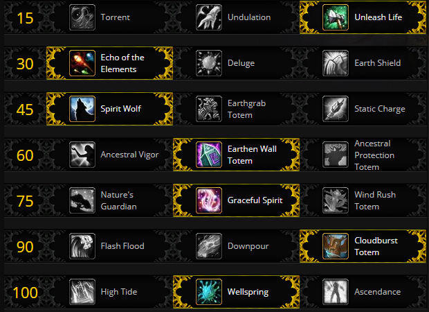

# Fight Mechanics

Conclave is this raid's council boss.  You are first tasked with fighting both the Aspect of Pa'ku and Gonk.  When one of them is defeated, the Aspect of Kimbul joins the encounter.  When the second Aspect is killed, Akunda's Aspect joins the fight.  When all four are defeated, the encounter is over.  When any of the four Aspect dies, a [Cry of the Fallen](https://www.wowhead.com/spell=286060/cry-of-the-fallen) is triggered dealing large amounts of raid damage, as well as a [Loa's Wrath](https://www.wowhead.com/spell=282736/loas-wrath) which increases the damage of all remaining active Aspects by 15%.  This means Kimbul and Akunda will both spawn with 15% increased damage since they enter the fight after another Aspect is slain.  Throughout the encounter, multiple Loa show up in spirit form and perform some sort of attack.  The Loa have the following abilities:

* Pa'ku casts [Pa'ku's Wrath](https://www.wowhead.com/spell=282107/pakus-wrath) which deals large raid damage unless you are within the circle beneath Pa'ku where the damage will be decreased greatly.  This still deals a large amount of damage even while within the safety area.
* Gonk summons four raptors around the room that fixate on players and get faster the longer they are alive.  These raptors can be stunned and displacement effects work on them as well.
* Kimbul targets multiple raid members and leaps on them one after another stunning all players within 5 yards of each chosen player and applying a permanent bleed.
* Akunda targets multiple DPS players with Akunda's Wrath which causes [lightning orb](https://www.wowhead.com/spell=286833/static-orb)s to be expelled from each player with the debuff when it fades.  These lightning orbs stun on contact.
* Krag'wa chooses the furthest target from him and leaps to that players location dealing large damage on impact to anyone in the landing zone as well as knocking players away.  He jumps a total of 4 times.
* Bwonsomdi appears only on Mythic difficulty and applies a permanent curse debuff, [Bwonsamdi's Wrath](https://www.wowhead.com/spell=284663), that prevents all healing done to the target.  When dispelled this curse jumps to the nearest player.

The Aspects themselves have a few notable abilities.  Gonk's Aspect casts [Crawling Hex](https://www.wowhead.com/spell=282135/crawling-hex) which will hex multiple raid members and if they are dispelled near other players will cause the other players to be hexed.  Pa'ku's Aspect casts [Gift of the Wind](https://www.wowhead.com/spell=282098/gift-of-wind) which causes all bosses and minions in the room to gain movement speed and haste.  This needs to be [purge](https://www.wowhead.com/spell=370/purge)d or dispelled as quickly as possible.  Kimbul's Aspect casts a frontal cleave that leaves a large bleed on anyone hit, prioritize healing these targets.  Akunda's Aspect casts [Mind Wipe](https://www.wowhead.com/spell=285878/mind-wipe) which causes a 30 second lockout on all abilities and spells unless dispelled.  This is a magic debuff meaning it can only be dispelled by healers or priests with mass dispel.

# Suggested Talents

Since this encounter has strictly windows of burst damage and [Bwonsomdi's Curse](https://www.wowhead.com/spell=284663/bwonsamdis-wrath) soaks bounces of [Chain Heal](https://www.wowhead.com/spell=1064/chain-heal), it is recommended that you either take [Wellspring](https://www.wowhead.com/spell=197995/wellspring).  Using [Wellspring](https://www.wowhead.com/spell=197995/wellspring) will help cover the more consistent raid damage from [Kimbul's Wrath](https://www.wowhead.com/spell=282447/kimbuls-wrath).  [EWT](https://www.wowhead.com/spell=198838/earthen-wall-totem) lines up just about perfectly for each [Paku's Wrath](https://www.wowhead.com/spell=282107/pakus-wrath) and makes it a pretty clear choice.  You could choose [APT](https://www.wowhead.com/spell=207399/ancestral-protection-totem) instead if you would rather have a larger effective health increase for one window rather than a lower, more consistent effective raid health increase.

# Notable Azerite Traits

[Spouting Spirits](https://www.wowhead.com/spell=279504/spouting-spirits) is the only notable azerite trait for this encounter.  When used during a [Pa'ku's Wrath](https://www.wowhead.com/spell=282107/pakus-wrath), your raid should be never in danger of dying.

# Healing Tips

* Dispel [Bwonsomdi's Wrath](https://www.wowhead.com/spell=284663/bwonsamdis-wrath) on people who are below 50% health or right before a [Pa'ku's Wrath](https://www.wowhead.com/spell=282107/pakus-wrath).
* Save EWT for every [Pa'ku's Wrath](https://www.wowhead.com/spell=282107/pakus-wrath).
* If a tank ever gets [Bwonsomdi's Wrath](https://www.wowhead.com/spell=284663/bwonsamdis-wrath), instantly dispel them.
