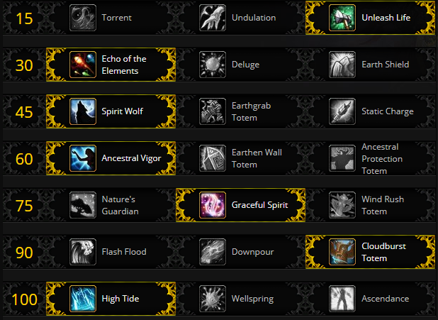

# Fight Mechanics

During phase 1 of Opulence you will be placed on either left or right hallway.  If you are placed on the left hallway, you will have to deal with healing people who get [Volatile Charge](https://www.wowhead.com/spell=283507/volatile-charge).  If you are targeted with [Volatile Charge](https://www.wowhead.com/spell=283507/volatile-charge), make sure it expires on you when you are at the side of the room, preferably where you entered rather than where you need to go.  If you are on the right side, you will have to deal with [Flames of Punishment](https://www.wowhead.com/spell=282939/flames-of-punishment).  Stay behind the boss to avoid taking damage from [Flames of Punishment](https://www.wowhead.com/spell=282939/flames-of-punishment).  On either side, avoid being infront of the mini-boss when they cast [Crush](https://www.wowhead.com/spell=283604/crush).  Once a mini-boss has taken 10% of its health in damage, it will move to the next trapped room.  The traps in the room follow this pattern:

  1. Nothing (100-90)
  2. [Flame Jets](https://www.wowhead.com/spell=285479/flame-jet) (90-80)
  3. [Laser](https://www.wowhead.com/spell=284081/ruby-beam) (80-70)
  4. [Poison](https://www.wowhead.com/spell=284493/pulse-quickening-toxin) (70-60)
  5. [Laser](https://www.wowhead.com/spell=284081/ruby-beam) with [Hex of Lethargy](https://www.wowhead.com/spell=284470/hex-of-lethargy) (60-50)
  6. [Flame Jets](https://www.wowhead.com/spell=285479/flame-jet) (50-40)
  7. Gems (40-30)
  8. Empowered Room (30-0)

In the final room, the mini-bosses will pulse damage to raid members in the room with them, as well as their special abilities ([Volatile Charge](https://www.wowhead.com/spell=283507/volatile-charge) and [Flames of Punishment](https://www.wowhead.com/spell=282939/flames-of-punishment)) grow in size.  As a Restoration Shaman you will be grabbing either the [Amethyst](https://www.wowhead.com/spell=284558/amethyst-of-the-shadow-king) or [Sapphire](https://www.wowhead.com/spell=284567/tailwind-sapphire) gem.  If you are grabbing [Amethyst](https://www.wowhead.com/spell=284558/amethyst-of-the-shadow-king), you will want to heal everyone with [Thief's Bane](https://www.wowhead.com/spell=287424/thiefs-bane) before it expires to prevent them from dying.  Also when you reach phase 2 you will need to cover the entire raid with [Shadow-Touched](https://www.wowhead.com/spell=284556/shadow-touched) to prevent them from dying to [Wail of Greed](https://www.wowhead.com/spell=284941/wail-of-greed).  On Mythic difficulty, DPS members will periodically be transferred between sides, 2 at a time.  You don't have to worry about this as a healer.  The other mythic change is the duration of [Shadow-Touched](https://www.wowhead.com/spell=284556/shadow-touched) and [Tailwinds](https://www.wowhead.com/spell=284573/tailwinds) is much shorter on Mythic which means you'll need to reapply these buffs much more often.  
In Phase 2, you will actually be fighting Opulence.  Heal raid members targeted by [Liquid Gold](https://www.wowhead.com/spell=287072/liquid-gold), move out with [Liquid Gold](https://www.wowhead.com/spell=287072/liquid-gold) to the stairs / hallways around the room to leave the center platform clear, and heal the raid when they take damage from [Coin Shower](https://www.wowhead.com/spell=285014/coin-shower) and [Wail of Greed](https://www.wowhead.com/spell=284941/wail-of-greed).  The Final mythic change is the boss will periodically expand the size of [Liquid Gold](https://www.wowhead.com/spell=287072/liquid-gold) throughout the room with [Surging Gold](https://www.wowhead.com/spell=289155/surging-gold).  Make sure if you are dropping a [Liquid Gold](https://www.wowhead.com/spell=287072/liquid-gold) that you will not be caught in the [Surging Gold](https://www.wowhead.com/spell=289155/surging-gold).

# Suggested Talents

 You can consider taking [EWT](https://www.wowhead.com/spell=198838/earthen-wall-totem) over [AV](https://www.wowhead.com/spell=207401/ancestral-vigor) to cover slightly more [Crush](https://www.wowhead.com/spell=283604/crush) damage in phase 1, but it is not really something to worry about.  [Wellspring](https://www.wowhead.com/spell=197995/wellspring) can also be taken if you are assigned to Amethyst to spread [Shadow-Touched](https://www.wowhead.com/spell=284556/shadow-touched).

# Notable Azerite Traits

[Turn of the Tide](https://www.wowhead.com/spell=287300/turn-of-the-tide), [Spouting Spirits](https://www.wowhead.com/spell=279504/spouting-spirits), and [Overflowing Shores](https://www.wowhead.com/spell=278095/overflowing-shores) are all good options for azerite traits on this boss.  [Turn of the Tide](https://www.wowhead.com/spell=287300/turn-of-the-tide) will help healing people with [Liquid Gold](https://www.wowhead.com/spell=287072/liquid-gold).  [Spouting Spirits](https://www.wowhead.com/spell=279504/spouting-spirits) is good to apply [Shadow-touched](https://www.wowhead.com/spell=284556/shadow-touched) to everyone inside your [SLT](https://www.wowhead.com/spell=98008/spirit-link-totem) just before a [Wail of Greed](https://www.wowhead.com/spell=284941/wail-of-greed).  [Overflowing Shores](https://www.wowhead.com/spell=278095/overflowing-shores) provides an extra heal event at the start of [Healing Rain](https://www.wowhead.com/spell=73920/healing-rain) to apply an extra stack of [Tailwinds](https://www.wowhead.com/spell=284573/tailwinds) if you have the [Sapphire](https://www.wowhead.com/spell=284567/tailwind-sapphire).

# Healing Tips

* The majority of this fight is dealing with mechanics in the hallways, play well and make sure you stay alive.
* Mana shouldn't be an issue in this fight since as soon as [Amethyst](https://www.wowhead.com/spell=284558/amethyst-of-the-shadow-king)s are picked up, any shadow damage will return mana back to anyone stood within 10 yards of someone who takes shadow damage while they have [Shadow Touched](https://www.wowhead.com/spell=284556/shadow-touched) on them.
